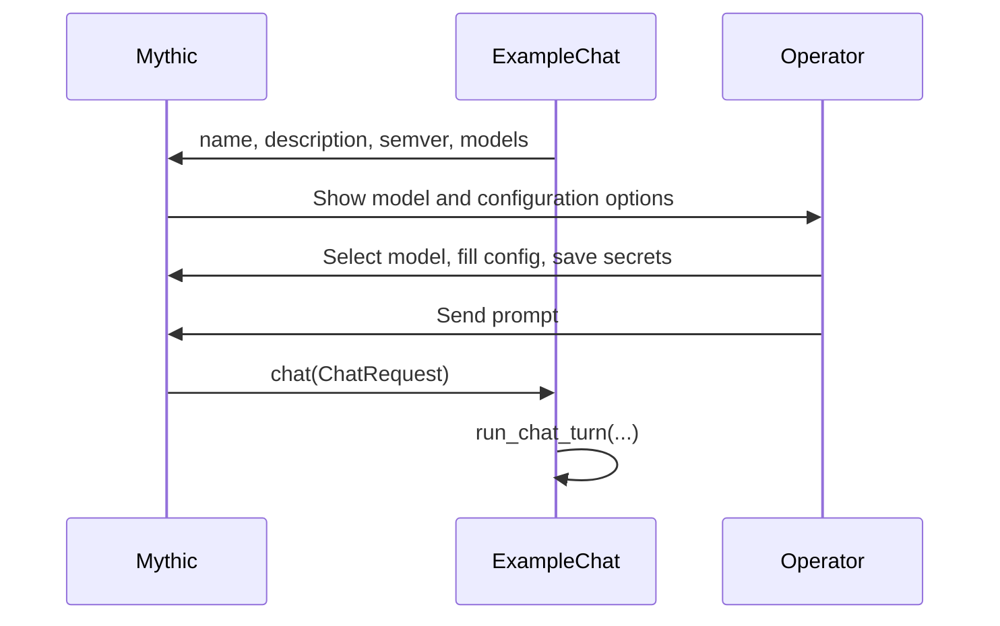
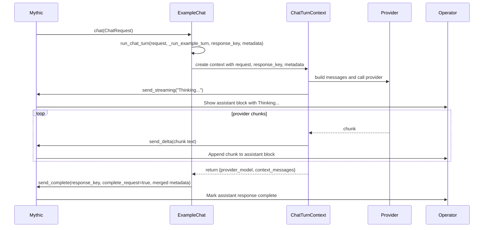
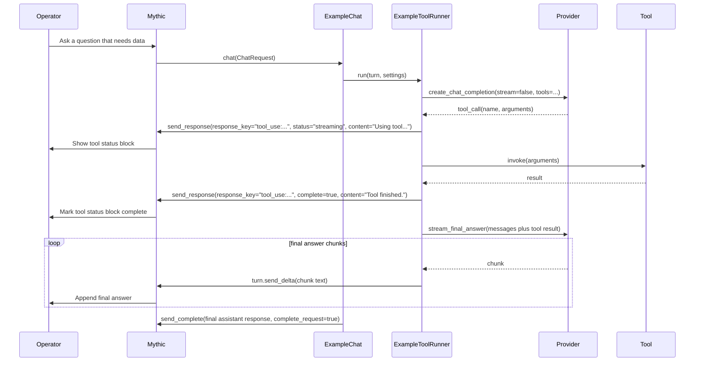
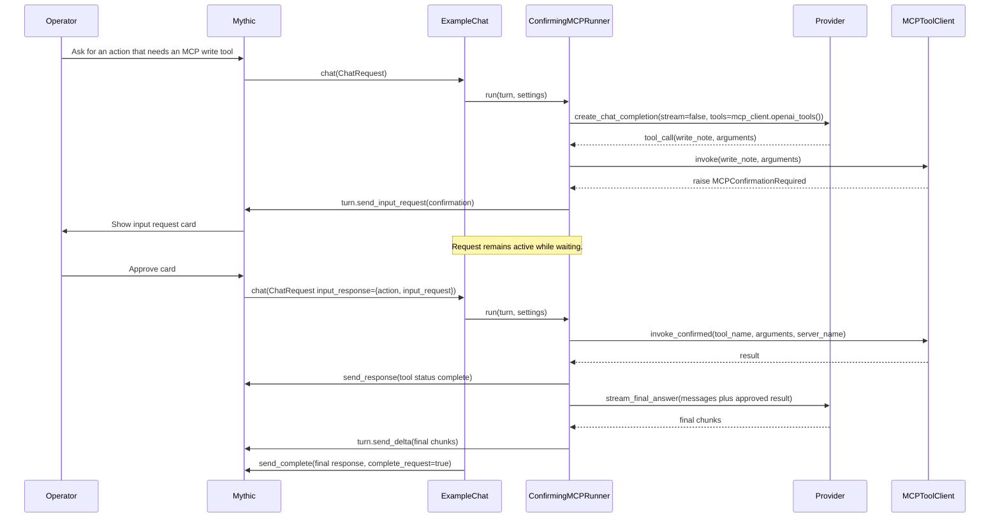

# Chat Containers Developer Guide

This guide is for developers writing their own Mythic chat container while
leaning on the helper functions already supplied by `mythic_container.ChatBase`.
The goal is to keep your container small: define your model contract, read typed
settings, build provider messages, stream responses, and use the shared helpers
for completion, errors, tool status, and human input requests.

The reference implementation is `InstalledServices/basic_chat`. The examples
below use simplified names, but the same pattern is used there:

- Keep `chat(self, msg)` as a small dispatcher.
- Put provider configuration in a typed settings dataclass.
- Use `self.run_chat_turn(...)` for the normal request lifecycle.
- Use `self.build_chat_messages(...)` for provider-friendly conversation input.
- Use `turn.send_delta(...)` for streamed assistant text.
- Use `self.send_response(...)` only when you need a custom response block, such
  as a tool status card.
- Use `turn.send_input_request(...)`, `turn.send_approval_request(...)`, or
  `turn.send_single_choice_request(...)` when the container needs operator
  input before continuing.

## Class Definition

A chat container is a subclass of `Chat`. The class-level fields tell Mythic
what service is available and which models operators can pick. The `chat`
method is the runtime entrypoint Mythic calls for each operator message.

Start with imports and a typed settings class:

```python
from dataclasses import dataclass

from mythic_container.ChatBase import (
    Chat,
    ChatConfigView,
    ChatInputChoice,
    ChatInputResponse,
    ChatModelConfigurationOption,
    ChatModelConfigurationOptionChoice,
    ChatModelConfigurationOptionType,
    ChatModelDefinition,
    ChatModelMetadata,
    ChatRequest,
    ChatSecretView,
    ChatSlashCommandDefinition,
    ChatTurnContext,
)


@dataclass(frozen=True)
class ExampleSettings:
    """Provider settings for one Mythic chat request.

    Keep this separate from your Chat subclass so config validation is explicit
    and easy to test. The keys here are your container's contract, not a
    framework-wide schema.
    """

    api_key: str
    base_url: str
    model: str
    max_context_messages: int
    stream: bool

    @classmethod
    def from_request(cls, msg: ChatRequest):
        config = ChatConfigView.from_request(msg)
        secrets = ChatSecretView.from_request(msg)
        return cls(
            # required_text raises a clear error. run_chat_turn will turn that
            # into an operator-visible error response if you call it inside the
            # handler.
            api_key=secrets.required_text("EXAMPLE_API_KEY"),
            base_url=config.required_text("EXAMPLE_URL"),
            model=config.text("EXAMPLE_MODEL", "example-default"),
            max_context_messages=config.integer("EXAMPLE_MAX_CONTEXT", 20),
            stream=config.boolean("EXAMPLE_STREAM", True),
        )
```

Then define the model configuration Mythic should show operators:

```python
ExampleConfigurationOptions = [
    ChatModelConfigurationOption(
        Name="EXAMPLE_URL",
        DisplayName="Example Provider URL",
        Type=ChatModelConfigurationOptionType.String,
        Description="OpenAI-compatible base URL reachable from the chat container.",
        Required=True,
    ),
    ChatModelConfigurationOption(
        Name="EXAMPLE_MODEL",
        DisplayName="Provider Model",
        Type=ChatModelConfigurationOptionType.String,
        Description="Model name to pass to the provider SDK.",
        Required=False,
        DefaultValue="example-default",
    ),
    ChatModelConfigurationOption(
        Name="EXAMPLE_MAX_CONTEXT",
        DisplayName="Max Context Messages",
        Type=ChatModelConfigurationOptionType.Number,
        Description="Prior Mythic chat messages to send to the model. Use 0 for all context Mythic provided.",
        Required=False,
        DefaultValue=20,
    ),
    ChatModelConfigurationOption(
        Name="EXAMPLE_MODE",
        DisplayName="Mode",
        Type=ChatModelConfigurationOptionType.Choice,
        Description="Operator-facing behavior profile for this chat.",
        Required=False,
        DefaultValue="balanced",
        Choices=[
            ChatModelConfigurationOptionChoice(Label="Balanced", Value="balanced"),
            ChatModelConfigurationOptionChoice(Label="Fast", Value="fast"),
        ],
    ),
    ChatModelConfigurationOption(
        Name="EXAMPLE_STREAM",
        DisplayName="Stream Responses",
        Type=ChatModelConfigurationOptionType.Boolean,
        Description="When enabled, provider chunks are appended as they arrive.",
        Required=False,
        DefaultValue=True,
    ),
]
```

Finally define the `Chat` subclass:

```python
class ExampleChat(Chat):
    name = "example_chat"
    description = "Example chat container that uses ChatBase helpers."
    semver = "0.1.0"

    models = [
        ChatModelDefinition(
            Name="Example",
            Description="Streams responses from the example provider.",
            Metadata=ChatModelMetadata(
                Provider="example-provider",
                ConfigurationOptions=ExampleConfigurationOptions,
                # Mythic can show these secret requirements to the operator.
                RequiredUserSecrets=["EXAMPLE_API_KEY"],
                # Add channel token scopes only if your chat needs Mythic API
                # access, such as querying callbacks or creating tasks.
                RequiredChannelAPITokenScopes=["chat-ai.write"],
                SlashCommands=[
                    ChatSlashCommandDefinition(
                        Name="summarize",
                        Description="Summarize the current chat context.",
                    ),
                ],
            ),
        ),
    ]

    async def chat(self, msg: ChatRequest) -> None:
        """Main Mythic entrypoint.

        Keep this method small. Choose the model path, choose a response key,
        attach stable metadata, and delegate the actual provider work.
        """

        await self.run_chat_turn(
            msg,
            self._run_example_turn,
            response_key=f"assistant:example:{msg.RequestID}",
            model=msg.Model or "Example",
            metadata={
                "container": self.name,
                "model": msg.Model or "Example",
                "provider": "example-provider",
            },
        )
```

What each class piece affects in Mythic:

- `name`: the installed service name Mythic syncs and routes requests to.
- `description`: operator-facing service description.
- `semver`: version string Mythic can display during sync.
- `models`: model choices available in the chat UI.
- `ChatModelConfigurationOption`: fields operators configure per chat model.
- `RequiredUserSecrets`: user secret names Mythic expects before the model can
  run.
- `RequiredChannelAPITokenScopes`: delegated Mythic API token scopes your chat
  needs for tool access.
- `SlashCommands`: slash commands Mythic can advertise for this model.
- `chat(msg)`: called once for each operator request or continuation approval.



## Basic Chat Response

For a normal assistant answer, prefer `run_chat_turn`. It creates a
`ChatTurnContext`, catches ordinary exceptions, sends an error response when
needed, and sends final completion when your handler returns metadata.

```python
class ExampleChat(Chat):
    # class metadata omitted for brevity

    async def chat(self, msg: ChatRequest) -> None:
        await self.run_chat_turn(
            msg,
            self._run_example_turn,
            response_key=f"assistant:example:{msg.RequestID}",
            model=msg.Model or "Example",
            metadata={"container": self.name, "provider": "example-provider"},
        )

    async def _run_example_turn(self, turn: ChatTurnContext) -> dict:
        """Handle one operator prompt.

        Returning a dict tells run_chat_turn to complete the assistant block and
        merge these values into the final response metadata.
        """

        settings = ExampleSettings.from_request(turn.request)

        messages = self.build_chat_messages(
            turn.request,
            system_prompt=self._system_prompt(turn.request),
            max_context_messages=settings.max_context_messages,
        )

        # Optional: create a visible assistant block immediately. Operators see
        # the response start even if the provider takes a moment to send tokens.
        await turn.send_streaming("Thinking...\n\n")

        async for provider_delta in stream_from_provider(settings, messages):
            # Provider SDKs return different chunk shapes. normalize_stream_delta
            # accepts strings, dicts with text/content, lists, or objects with
            # text/content attributes and gives you the text to append.
            delta_text = self.normalize_stream_delta(provider_delta)
            if delta_text:
                # Operators see this appended to the same response block.
                await turn.send_delta(delta_text)

        return {
            "provider_model": settings.model,
            "context_messages": len(turn.request.Context),
        }

    def _system_prompt(self, msg: ChatRequest) -> str:
        return (
            "You are an assistant embedded in a Mythic operation chat. "
            f"The current channel is #{msg.ChannelSlug}. "
            "Answer with concise Markdown."
        )
```

`build_chat_messages` turns Mythic chat context into provider-friendly
`role/content` messages:

- Adds your system prompt first, if supplied.
- Includes prior messages from `msg.Context`.
- Uses `role="assistant"` for prior AI messages.
- Uses `role="user"` for operator messages.
- Prefixes user messages with sender names by default.
- Skips the current request message from context and appends `msg.Prompt` as
  the final user message.

Use `max_context_messages` to keep provider context under control. Use
`include_sender_names=False` if your provider should not see names in content.

```python
messages = self.build_chat_messages(
    msg,
    system_prompt="You are a careful Mythic assistant.",
    max_context_messages=10,
    include_sender_names=True,
)
```

`run_chat_turn` lifecycle:



When to use each response function in this basic path:

- `turn.send_streaming(content)`: starts or replaces the active assistant block.
- `turn.send_delta(content)`: appends text to the active assistant block.
- `turn.send_text(content)`: replaces the active assistant block with a full
  string while keeping it open.
- `turn.send_complete(...)`: only call this yourself if you are not using
  `run_chat_turn` for completion.
- `turn.send_error(error)`: only call this yourself for errors you handle
  deliberately; `run_chat_turn` catches ordinary exceptions for you.

If your provider does not stream, keep the same lifecycle and use `send_text`:

```python
async def _run_non_streaming_turn(self, turn: ChatTurnContext) -> dict:
    settings = ExampleSettings.from_request(turn.request)
    messages = self.build_chat_messages(turn.request, system_prompt="Help the operator.")
    answer = await complete_from_provider(settings, messages)

    # Operators see the full answer appear at once. run_chat_turn still sends
    # the final completion marker after this handler returns.
    await turn.send_text(answer)
    return {"provider_model": settings.model}
```

## Using Tools

Tools add two visible streams of activity:

1. Tool status blocks, so operators can see what the assistant is doing.
2. The final assistant answer, streamed through the normal response key.

The shared `Chat` class does not define your provider's tool loop because every
provider SDK has different request and response objects. The helpers still do a
lot of useful work:

- `build_chat_messages(...)` builds the initial provider messages.
- `normalize_stream_delta(...)` normalizes provider chunks for streaming.
- `truncate_text(...)` keeps tool results small before sending them back to the
  model.
- `send_response(...)` lets you create separate tool status blocks with their
  own `response_key`.
- `run_chat_turn(...)` completes the final assistant block when your tool loop
  returns.

Here is a minimal pattern for a provider that supports OpenAI-style tools:

```python
TOOL_USE_SPECIAL_TYPE = "tool_use"


class ExampleToolRunner:
    def __init__(self, turn: ChatTurnContext, settings: ExampleSettings):
        self.turn = turn
        self.settings = settings
        self.request = turn.request

    async def run(self) -> dict:
        messages = self.turn.chat.build_chat_messages(
            self.request,
            system_prompt="Use tools when they materially improve accuracy.",
            max_context_messages=self.settings.max_context_messages,
        )
        tools = self._openai_tools()

        # First provider pass is not streamed. This lets the model return
        # structured tool calls instead of partial visible text.
        response = await create_chat_completion(
            settings=self.settings,
            messages=messages,
            tools=tools,
            stream=False,
        )

        tool_calls = response.tool_calls or []
        if tool_calls:
            messages.append(response.as_assistant_message())

        for index, tool_call in enumerate(tool_calls, start=1):
            tool_name = tool_call.function.name
            arguments = parse_tool_arguments(tool_call.function.arguments)
            response_key = f"tool_use:{tool_call.id}:{tool_name}"

            await self._send_tool_status(
                response_key=response_key,
                content=f"Using tool `{tool_name}`...",
                status="started",
                tool_name=tool_name,
                complete=False,
            )

            result = await self._invoke_tool(tool_name, arguments)

            await self._send_tool_status(
                response_key=response_key,
                content=f"Tool `{tool_name}` finished.",
                status="completed",
                tool_name=tool_name,
                complete=True,
                result_preview=self.turn.chat.truncate_text(result.replace("\n", " "), 240),
                output=result,
            )

            messages.append({
                "role": "tool",
                "tool_call_id": tool_call.id,
                "name": tool_name,
                # Keep large tool output out of the provider context.
                "content": self.turn.chat.truncate_text(result, 12000),
            })

        # Final answer is streamed into the original assistant response key,
        # because turn.send_delta always uses turn.response_key.
        async for chunk in stream_final_answer(self.settings, messages):
            delta_text = self.turn.chat.normalize_stream_delta(chunk)
            if delta_text:
                await self.turn.send_delta(delta_text)

        return {"tool_call_count": len(tool_calls)}

    async def _send_tool_status(
            self,
            response_key: str,
            content: str,
            status: str,
            tool_name: str,
            complete: bool,
            result_preview: str = "",
            output: str = "") -> None:
        """Create or update a separate Mythic response block for one tool.

        Use send_response directly here because this block is not the final
        assistant answer. It needs a different response_key and custom metadata
        so the UI can render it as a tool-use status card.
        """

        await self.turn.chat.send_response(
            self.request,
            response_key=response_key,
            content=content,
            status="complete" if complete else "streaming",
            complete=complete,
            metadata=self.turn._metadata({
                "special_type": TOOL_USE_SPECIAL_TYPE,
                "tool_use": {
                    "status": status,
                    "tool_name": tool_name,
                    "tool_source": "example",
                    "requires_confirmation": False,
                    "result_preview": result_preview,
                    "output": output,
                },
            }),
        )
```

Wire the runner into your `Chat` subclass with `run_chat_turn`:

```python
class ExampleChat(Chat):
    async def chat(self, msg: ChatRequest) -> None:
        await self.run_chat_turn(
            msg,
            self._run_tool_turn,
            response_key=f"assistant:example:{msg.RequestID}:final",
            metadata={"container": self.name, "provider": "example-provider"},
        )

    async def _run_tool_turn(self, turn: ChatTurnContext) -> dict:
        settings = ExampleSettings.from_request(turn.request)
        return await ExampleToolRunner(turn, settings).run()
```

Tool flow from the operator's point of view:



The key design choice is response keys:

- Use one stable final answer key, such as `assistant:example:<request_id>:final`.
- Use separate keys for tool status, such as `tool_use:<tool_call_id>:<tool_name>`.
- Do not send tool status through `turn.send_delta`, because that would append
  tool text into the final assistant answer.
- Keep `result_preview` short, and put the full raw result in
  `tool_use.output` only on the completed tool card. Mythic stores that output
  outside normal chat subscriptions and loads it lazily from the tool card.

## Sub-Agent Delegations

When a supervisor delegates work, emit one sub-agent card in the main timeline
and tag every message from that delegated turn with the same top-level
`delegation_id`. The drill-down pane is just a filtered view of the flat channel;
do not nest tool cards inside the sub-agent card.

```python
delegation_id = f"bloodhound:{msg.RequestID}"
delegation_name = "BloodHound"
delegation_title = "BloodHound"
delegation_prompt = "List all domains and report identifying details, trusts, and collection gaps."

await turn.send_subagent_status(
    title=delegation_title,
    prompt=delegation_prompt,
    delegation_id=delegation_id,
    delegation_name=delegation_name,
    status="running",
    tool_count=0,
    tool_total=13,
    icon="diagram-project",
    icon_color="#9b59b6",
)

# Tool cards and input requests should use the same delegation fields.
# Put the final delegated answer in the terminal subagent status content.
await turn.chat.send_response(
    msg,
    response_key=f"tool_use:{delegation_id}:domains",
    content="Using tool `list_domains`...",
    status="streaming",
    metadata=turn._metadata({
        "delegation_id": delegation_id,
        "delegation_name": delegation_name,
        "special_type": "tool_use",
        "tool_use": {
            "status": "started",
            "tool_name": "list_domains",
            "tool_source": "bloodhound",
        },
    }),
)

await turn.send_subagent_status(
    title=delegation_title,
    prompt=delegation_prompt,
    delegation_id=delegation_id,
    delegation_name=delegation_name,
    status="finished",
    tool_count=13,
    tool_total=13,
    icon="diagram-project",
    icon_color="#9b59b6",
    content="Found two domains and their identifying details.",
    complete=True,
)
```

Do not also send a separate normal delegated assistant response for this same
final text; Mythic persists terminal subagent `content` as the side-panel final
agent message.

Use `title` for a compact sub-agent label and `prompt` for the longer delegated
instructions shown in the side panel and expanded summary. `icon` may be a
short text badge such as `BH`, or a Font Awesome solid icon name using the
browser-script convention, such as `diagram-project`, `fa-diagram-project`, or
`fas fa-diagram-project`; pair it with any CSS `icon_color`.

If Mythic sends a side-panel prompt back to the container, `msg.DelegationID`
and `msg.DelegationName` are populated. `ChatTurnContext._metadata(...)`
automatically carries those fields onto responses and input requests unless you
explicitly set different values.

## Requesting Human Input

Use an input request when a tool can write state, task an agent, create a
payload, modify a ticket, edit a file, or otherwise needs operator input before
the current chat flow can continue. Input requests are generic: approval cards,
free-text responses, and single-choice lists all use the same
`input_requested` card and the same `msg.InputResponse` continuation.

`turn.send_input_request(...)` accepts a dictionary or object with
`to_input_request()`. The helper also provides convenience wrappers:

- `turn.send_approval_request(...)` for Accept, Reject, or Respond.
- `turn.send_single_choice_request(...)` for a clickable one-of-many list.

Input request cards complete the visible card message, but they do not complete
the chat request. When the operator acts, Mythic updates the same card with the
resolver and response data, then calls the chat container again with the same
`RequestID` and `msg.InputResponse` populated.

```python
from mythic_container.chat_mcp import (
    MCPConfirmationRequired,
    MCPStreamableHTTPConnection,
    MCPToolClient,
)


class ConfirmingMCPRunner:
    def __init__(self, turn: ChatTurnContext, settings: ExampleSettings):
        self.turn = turn
        self.request = turn.request
        self.settings = settings

    async def run(self) -> dict | None:
        if self.request.InputResponse:
            return await self._run_input_response(self.request.InputResponse)
        return await self._run_first_pass()

    async def _mcp_client(self) -> MCPToolClient:
        connection = MCPStreamableHTTPConnection(
            name="docs",
            url="http://docs-mcp:8000/mcp",
            headers={"Authorization": f"Bearer {self.settings.api_key}"},
            # These server tool names can run without approval. Every other MCP
            # tool pauses and becomes a Mythic confirmation card.
            read_only_tools=("search_docs", "render_prompt"),
        )
        return await MCPToolClient.create(connections=[connection])

    async def _run_first_pass(self) -> dict | None:
        mcp_client = await self._mcp_client()
        try:
            messages = self.turn.chat.build_chat_messages(
                self.request,
                system_prompt=(
                    "Use MCP tools when useful. If a write-capable MCP tool is "
                    "needed, call it normally; Mythic will ask the operator for approval."
                ),
            )
            tools = mcp_client.openai_tools()
            response = await create_chat_completion(
                settings=self.settings,
                messages=messages,
                tools=tools,
                stream=False,
            )

            for tool_call in response.tool_calls or []:
                tool_name = tool_call.function.name
                arguments = parse_tool_arguments(tool_call.function.arguments)

                try:
                    result = await mcp_client.invoke(tool_name, arguments)
                except MCPConfirmationRequired as confirmation:
                    # Operators see a generic Mythic input request card. The
                    # current chat request remains active while waiting.
                    await self.turn.send_input_request(confirmation)
                    return None

                messages.append({
                    "role": "tool",
                    "tool_call_id": tool_call.id,
                    "name": tool_name,
                    "content": self.turn.chat.truncate_text(result, 12000),
                })

            async for chunk in stream_final_answer(self.settings, messages):
                delta_text = self.turn.chat.normalize_stream_delta(chunk)
                if delta_text:
                    await self.turn.send_delta(delta_text)
            return {"input_request": "not_required"}
        finally:
            await mcp_client.close()
```

Why `return None` after an input request matters:

- `send_input_request` sends a completed card with the metadata Mythic needs.
- It leaves `complete_request=False`, so the current request is still the
  active flow.
- Returning `None` tells `run_chat_turn` not to send another final completion for
  the assistant response key.
- When the operator acts, Mythic calls the container with `msg.InputResponse`
  populated.

Continuation handler:

```python
class ConfirmingMCPRunner:
    # __init__, _mcp_client, and _run_first_pass omitted

    async def _run_input_response(self, input_response: ChatInputResponse) -> dict:
        if input_response.Action != "accept":
            return {
                "input_action": input_response.Action,
                "operator_response": input_response.Response,
                "selected_choice": input_response.Choice,
            }

        request_data = input_response.InputRequest.get("data") or {}
        mcp_client = await self._mcp_client()
        try:
            tool_name = str(request_data.get("tool_name") or "")
            server_name = str(request_data.get("server_name") or "")
            arguments = request_data.get("arguments")
            if not isinstance(arguments, dict):
                arguments = {}

            await self._send_confirmed_status(
                content=f"Using approved MCP tool `{tool_name}`...",
                status="started",
                complete=False,
                input_response=input_response,
            )

            # invoke_confirmed bypasses the read-only check, but only for the
            # exact approved server/tool/arguments from Mythic.
            result = await mcp_client.invoke_confirmed(
                tool_name,
                arguments,
                server_name=server_name,
            )

            await self._send_confirmed_status(
                content=f"Approved MCP tool `{tool_name}` finished.",
                status="completed",
                complete=True,
                input_response=input_response,
                result_preview=self.turn.chat.truncate_text(result.replace("\n", " "), 240),
                output=result,
            )

            messages = self.turn.chat.build_chat_messages(
                self.request,
                system_prompt="Answer using only the approved MCP result.",
            )
            messages.append({
                "role": "user",
                "content": (
                    f"The operator approved MCP tool `{tool_name}` on server `{server_name}`.\n"
                    f"Tool result:\n{self.turn.chat.truncate_text(result, 12000)}"
                ),
            })

            async for chunk in stream_final_answer(self.settings, messages):
                delta_text = self.turn.chat.normalize_stream_delta(chunk)
                if delta_text:
                    await self.turn.send_delta(delta_text)

            return {
                "approved_tool": tool_name,
                "approved_server": server_name,
            }
        finally:
            await mcp_client.close()

    async def _send_confirmed_status(
            self,
            content: str,
            status: str,
            complete: bool,
            input_response: ChatInputResponse,
            result_preview: str = "",
            output: str = "") -> None:
        request_data = input_response.InputRequest.get("data") or {}
        tool_name = str(request_data.get("tool_name") or "unknown_tool")
        response_key = f"tool_use:approved:{input_response.InputRequestMessageID}:{tool_name}"

        await self.turn.chat.send_response(
            self.request,
            response_key=response_key,
            content=content,
            status="complete" if complete else "streaming",
            complete=complete,
            metadata=self.turn._metadata({
                "special_type": "tool_use",
                "tool_use": {
                    "status": status,
                    "tool_name": tool_name,
                    "tool_source": "mcp",
                    "confirmed": True,
                    "requires_confirmation": False,
                    "input_request_message_id": input_response.InputRequestMessageID,
                    "result_preview": result_preview,
                    "output": output,
                },
            }),
        )
```

Input request flow:



Rules for input continuations:

- Treat `msg.InputResponse` as the source of truth.
- Rebuild your settings and MCP connections from the new request.
- For approvals, execute only the approved server, tool name, and arguments
  embedded in `msg.InputResponse.InputRequest["data"]`.
- For rejections, text responses, and choices, continue from the supplied
  action/response/choice data.
- Use a separate tool status `response_key` so the operator can see the approved
  action run.
- Stream the final answer through the original assistant response key for the
  same request.

## Helper Reference

Use this table when deciding which helper belongs in your code:

| Helper | Call it from | Why you use it | What the operator sees |
| --- | --- | --- | --- |
| `ChatConfigView.from_request(msg)` | Settings loader | Reads typed model config from `msg.Config`. | Nothing directly. Bad values become errors if raised inside `run_chat_turn`. |
| `ChatSecretView.from_request(msg)` | Settings loader | Reads user secrets, including wrapped secret dictionaries. | Nothing directly. Missing required secrets become errors. |
| `self.run_chat_turn(...)` | `chat(msg)` | Wraps handler execution, creates `ChatTurnContext`, catches exceptions, and sends final completion. | A completed assistant response or an error response. |
| `self.turn_context(...)` | Advanced custom lifecycle | Creates `ChatTurnContext` without automatic completion. | Nothing until you send responses. |
| `self.build_chat_messages(...)` | Provider request builder | Converts Mythic chat context into role/content messages. | Nothing directly; affects model quality and context. |
| `turn.send_streaming(...)` | Handler or runner | Starts/replaces the active assistant block. | A visible assistant block begins or updates. |
| `turn.send_delta(...)` | Streaming loop | Appends provider text to the active assistant block. | The answer grows chunk by chunk. |
| `turn.send_text(...)` | Non-streaming response | Sets the active assistant block to a full string. | The answer appears or is replaced at once. |
| `turn.send_input_request(...)` | Handler or tool approval path | Sends a generic input request card without completing the request. | Operator sees an input card. |
| `turn.send_approval_request(...)` | Approval path | Sends an Accept, Reject, or Respond card. | Operator sees approval actions. |
| `turn.send_single_choice_request(...)` | Choice path | Sends a one-of-many clickable choice list. | Operator picks one option. |
| `self.send_response(...)` | Custom blocks | Sends a response to any `response_key`, with custom metadata. | Tool cards, status blocks, or other custom UI blocks. |
| `self.send_complete(...)` | Manual lifecycle | Marks one response block complete. | Response block stops streaming; request may complete. |
| `self.send_error(...)` | Manual error handling | Marks a response as failed. | Operator sees an error message. |
| `self.normalize_stream_delta(...)` | Provider streaming loop | Converts SDK chunk shapes into text. | Prevents empty or malformed chunks from showing. |
| `self.truncate_text(...)` | Tool result handling | Caps large text before returning it to the model or metadata. | Avoids giant context/tool previews. |

The happy path is intentionally small: define your class, call
`run_chat_turn`, build messages with `build_chat_messages`, stream with
`turn.send_delta`, and return metadata. Reach for lower-level helpers only when
you need separate visible blocks or confirmation behavior.
