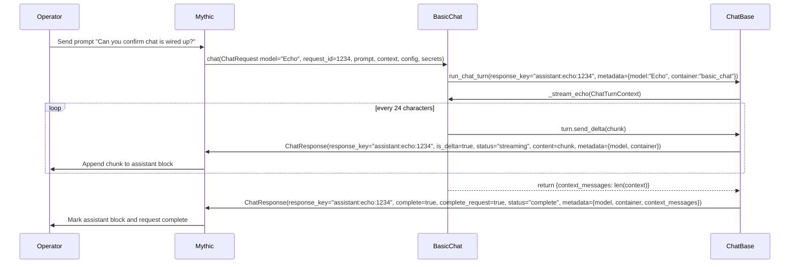
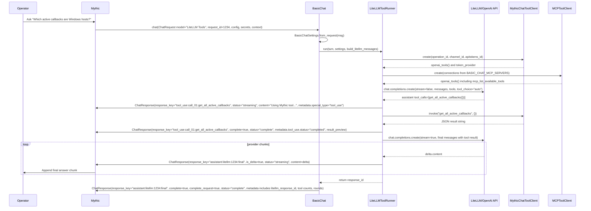
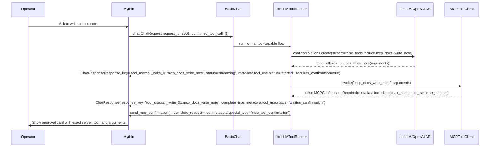
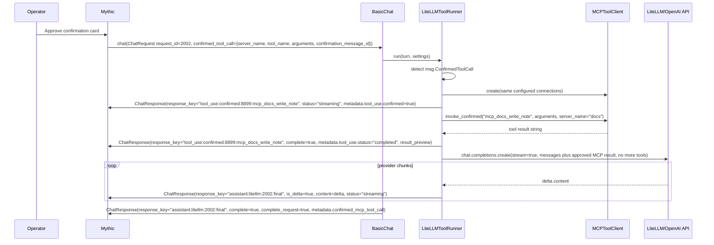

# Chat Containers

The `Chat` base class lets a container receive an operator prompt from Mythic,
call whatever model or tool system it owns, and send one or more
`ChatResponse` messages back to the Mythic UI. The base class intentionally
stays provider-neutral. Your container decides how model names, API keys, HTTP
headers, tool policies, MCP servers, and prompt templates work.

`basic_chat` is the reference implementation to copy from
when building a new chat container. It has two useful paths:

- `Echo`: a tiny streaming model that demonstrates the Mythic chat lifecycle.
- `LiteLLM Tools`: a realistic provider-backed flow with Mythic tools, MCP
  tools, MCP confirmation cards, and continuation after approval.

The examples below use BasicChat names so you can compare the documentation to
that container, but the same patterns apply to any `Chat` subclass.

## Operator Flow

From an operator's point of view, the flow is:

1. Select a chat model in a Mythic chat channel.
2. Configure the model options and required user secrets for that channel.
3. Send a message, slash command, or approved tool continuation.
4. Mythic sends your container one `ChatRequest`.
5. Your container sends zero or more visible response parts through
   `SendMythicRPCChatResponse`.
6. Your container marks individual response parts complete and eventually marks
   the whole request complete.
7. If a write-capable MCP tool needs approval, your container sends an MCP
   confirmation response. Mythic finishes the first request, shows the approval
   card, and later sends a second `ChatRequest` with `msg.ConfirmedToolCall`
   populated if an operator approves it.

The important implementation rule is that `chat(msg)` is called once per Mythic
request. A continuation approval is not an in-process callback into the old
coroutine; it is a new `ChatRequest` that should rebuild the same typed settings
and run only the approved tool call.

## Data Shapes

`ChatRequest` is the input Mythic sends to your container:

```json
{
  "container_name": "basic_chat",
  "operation_id": 7,
  "channel_id": 44,
  "apitokens_id": 91,
  "channel_name": "Red Team AI",
  "channel_slug": "red-team-ai",
  "request_id": 1234,
  "request_message_id": 555,
  "model": "LiteLLM Tools",
  "prompt": "Which active callbacks are Windows hosts?",
  "config": {
    "LITELLM_URL": "http://litellm:4000/v1",
    "LITELLM_MODEL": "bedrock-claude-4-6-sonnet",
    "BASIC_CHAT_MCP_SERVERS": {"servers": []}
  },
  "secrets": {
    "LITELLM_API_KEY": {"value": "..."}
  },
  "context": [
    {
      "id": 554,
      "author_type": "operator",
      "sender_display_name": "alice",
      "message": "Previous chat message",
      "metadata": {},
      "created_at": "2026-07-07T18:00:00Z"
    }
  ],
  "slash_command": null,
  "confirmed_tool_call": {}
}
```

`ChatResponse` is the output your container sends back through the helper
methods:

```json
{
  "operation_id": 7,
  "request_id": 1234,
  "response_key": "assistant:litellm:1234:final",
  "content": "The active Windows callbacks are...",
  "is_delta": true,
  "complete": false,
  "complete_request": false,
  "status": "streaming",
  "error": "",
  "metadata": {
    "model": "LiteLLM Tools",
    "provider": "litellm",
    "api_model": "bedrock-claude-4-6-sonnet"
  }
}
```

Mythic groups response updates by `response_key`. Reuse the same key for one
visible assistant answer. Use different keys for separate visible blocks such
as tool-use cards, MCP confirmation cards, or a later final answer.

## Subclassing Chat

Every chat container defines metadata and one async `chat` entrypoint:

```python
from dataclasses import dataclass

from mythic_container.ChatBase import (
    Chat,
    ChatConfigView,
    ChatModelDefinition,
    ChatModelMetadata,
    ChatRequest,
    ChatSecretView,
)


@dataclass(frozen=True)
class MyProviderSettings:
    api_key: str
    base_url: str
    model: str
    max_context_messages: int

    @classmethod
    def from_request(cls, msg: ChatRequest):
        config = ChatConfigView.from_request(msg)
        secrets = ChatSecretView.from_request(msg)
        return cls(
            api_key=secrets.required_text("MY_PROVIDER_API_KEY"),
            base_url=config.required_text("MY_PROVIDER_URL"),
            model=config.text("MY_PROVIDER_MODEL", "default-model"),
            max_context_messages=config.integer("MY_MAX_CONTEXT_MESSAGES", 20),
        )


class MyChat(Chat):
    name = "my_chat"
    description = "Example provider-backed chat container."
    semver = "0.1.0"
    models = [
        ChatModelDefinition(
            Name="My Provider",
            Description="Streams responses from my provider.",
            Metadata=ChatModelMetadata(Provider="my-provider"),
        ),
    ]

    async def chat(self, msg: ChatRequest) -> None:
        settings = MyProviderSettings.from_request(msg)
        metadata = {
            "container": self.name,
            "model": msg.Model,
            "provider": "my-provider",
            "provider_model": settings.model,
        }
        response_key = f"assistant:my-provider:{msg.RequestID}"
        await self.send_streaming(msg, response_key, metadata=metadata)

        messages = self.build_chat_messages(
            msg,
            system_prompt="You are an assistant embedded in Mythic.",
            max_context_messages=settings.max_context_messages,
        )

        async for delta in stream_from_my_provider(settings, messages):
            await self.send_delta(msg, response_key, delta, metadata=metadata)

        await self.send_complete(msg, response_key, metadata=metadata, complete_request=True)
```

The important pattern is that `MyProviderSettings` owns the config contract. The
base class only helps read typed values from `msg.Config` and `msg.Secrets`. You
can also build this yourself each time in the `chat` call or use a helper class.

## Response Helpers

Use response helpers when you want Mythic-compatible status messages without
constructing `ChatResponse` objects by hand:

```python
response_key = f"assistant:my-provider:{msg.RequestID}"
metadata = {"provider": "my-provider", "provider_model": "model-a"}

await self.send_streaming(msg, response_key, metadata=metadata)
await self.send_delta(msg, response_key, "partial text", metadata=metadata)
await self.send_text(msg, "status:my-provider", "non-delta status text")
await self.send_complete(msg, response_key, metadata={**metadata, "response_id": "abc"}, complete_request=True)
await self.send_error(msg, "assistant:error", "provider request failed")
```

| Helper | Response fields | What Mythic should do | Use when |
| --- | --- | --- | --- |
| `send_streaming` | `status="streaming"`, `is_delta=False`, `content` optional | Create or replace the content for `response_key` while it is still active. | You want to seed an empty assistant block, show "thinking" text, or replace a progress message. |
| `send_delta` | `status="streaming"`, `is_delta=True`, `content` required | Append `content` to the existing text for `response_key`. | You receive token/chunk deltas from a provider and want a streaming typing effect. |
| `send_text` | `status="streaming"`, `is_delta=False`, `content` required | Set the full text for `response_key` without marking it complete. | You want to update a status card or overwrite a non-token-streaming block. |
| `send_complete` | `status="complete"`, `complete=True`, `complete_request` optional | Mark one response block complete and optionally finish the whole Mythic request. | The visible block is done. Set `complete_request=True` when no more response blocks will arrive for this request. |
| `send_error` | `status="error"`, `complete=True`, `complete_request=True` by default | Show an error and close the request unless you override `complete_request`. | Provider setup, tool execution, or streaming failed. |
| `send_mcp_confirmation` | Sends a complete response with `metadata.special_type="mcp_tool_confirmation"` and `complete_request=True` | Show Mythic's native MCP approval card. | A write-capable MCP tool raised `MCPConfirmationRequired`. |

`send_streaming` and `send_text` are intentionally similar: both send non-delta
content and leave the block active. The naming difference is about intent.
`send_streaming` reads as "this response has begun and more may come".
`send_text` reads as "set this response block to this exact text". Use
`send_delta` only when `content` is a true increment to append.

In `basic_chat`, `run_chat_turn(...)` wraps the common lifecycle.
It creates a `ChatTurnContext`,
passes it to your handler, catches ordinary exceptions with `send_error`, and
sends the final `send_complete` when the handler returns a dictionary. If the
handler returns `None`, `run_chat_turn` does not send a final completion. This
is useful for MCP confirmation flows where `send_mcp_confirmation` already
finished the request.

## Metadata

`metadata` is an opaque, JSON-serializable dictionary attached to every
`ChatResponse`. Mythic stores and returns it in later `ChatRequest.Context`
entries, and the UI can use well-known keys to render special cards. Treat it
as the machine-readable companion to `content`.

Good metadata is:

- Small and stable across updates to the same `response_key`.
- Safe to show to operation members.
- Free of API keys, bearer tokens, raw secrets, and large tool results.
- Specific enough that a future request can understand what happened.
- JSON-compatible: strings, numbers, booleans, lists, objects, or null.

Recommended common keys for assistant messages:

```json
{
  "container": "basic_chat",
  "model": "LiteLLM Tools",
  "provider": "litellm",
  "api_model": "bedrock-claude-4-6-sonnet",
  "credential_source": "user_secret",
  "base_url_source": "chat_config",
  "context_messages": 12,
  "litellm_response_id": "chatcmpl-abc123"
}
```

Recommended metadata for tool-use status cards:

```json
{
  "container": "basic_chat",
  "model": "LiteLLM Tools",
  "provider": "litellm",
  "special_type": "tool_use",
  "tool_use": {
    "status": "completed",
    "tool_name": "get_all_active_callbacks",
    "tool_source": "mythic",
    "arguments_present": false,
    "requires_confirmation": false,
    "tool_call_id": "call_01",
    "tool_call_round": 1,
    "tool_call_index": 1,
    "tool_call_count": 1,
    "result_preview": "3 active callbacks returned..."
  }
}
```

Recommended metadata for an MCP confirmation card:

```json
{
  "container": "basic_chat",
  "model": "LiteLLM Tools",
  "special_type": "mcp_tool_confirmation",
  "mcp_confirmation_required": true,
  "mcp_tool_confirmation": {
    "status": "pending",
    "server_name": "docs",
    "tool_name": "mcp_docs_write_note",
    "server_tool_name": "write_note",
    "arguments": {"path": "notes/findings.md", "content": "..."},
    "description": "MCP server docs: Write a note...",
    "parameters": {"type": "object", "properties": {}},
    "annotations": {},
    "read_only": false
  }
}
```

For normal text responses, Mythic does not impose a required metadata schema.
For special UI blocks, use `special_type` and place the special payload under a
namespaced key. BasicChat currently uses:

- `special_type: "tool_use"` with `tool_use` for tool status cards.
- `special_type: "mcp_tool_confirmation"` with `mcp_tool_confirmation` for MCP
  approval cards.

For context messages, `ChatMessageContext.Metadata` is whatever was attached to
that prior message. The default `build_chat_messages(...)` ignores metadata and
only converts prior message text into provider messages. If your provider needs
metadata-aware memory, write your own message builder and explicitly choose
which metadata keys to include.

## Simple Example: Echo Streaming

Operator prompt:

```text
Can you confirm chat is wired up?
```

Selected model: `Echo`

High-level behavior:

1. Mythic calls `BasicChat.chat(msg)`.
2. `chat` chooses the `Echo` path.
3. `run_chat_turn` creates a `ChatTurnContext` with response key
   `assistant:echo:<request_id>` and metadata `{model, container}`.
4. `_stream_echo` formats a deterministic Markdown response.
5. `_stream_echo` sends the response in small chunks with `turn.send_delta`.
6. `_stream_echo` returns `{"context_messages": len(msg.Context)}`.
7. `run_chat_turn` merges that return value into metadata and sends
   `send_complete(..., complete_request=True)`.



The first delta can create the visible response block; an explicit
`send_streaming` is not required. Use `send_streaming` first when you want an
empty block or a status message before provider tokens arrive.

## Complex Example: LiteLLM With a Read-Only Tool

Operator prompt:

```text
Which active callbacks are Windows hosts?
```

Selected model: `LiteLLM Tools`

Example provider tool call:

```json
{
  "id": "call_01",
  "type": "function",
  "function": {
    "name": "get_all_active_callbacks",
    "arguments": "{}"
  }
}
```

High-level behavior:

1. `BasicChat.chat(msg)` chooses `_handle_litellm_tools_request`.
2. `_handle_litellm_tools_request` creates base metadata for the final answer:
   provider, model, container, credential source, base URL source, and tool
   family.
3. `BasicChatSettings.from_request(msg)` reads `LITELLM_API_KEY` from user secrets.
4. `LiteLLMToolRunner.run()` sees no `msg.ConfirmedToolCall`, so it starts the
   normal tool-capable provider flow.
5. `MythicChatToolClient.create(...)` creates or reuses a delegated Mythic API
   token for this chat channel.
6. `BasicChatMCPSettings.from_request(...)` parses `BASIC_CHAT_MCP_SERVERS` and
   resolves `secret:<name>` values.
7. `MCPToolClient.create(...)` connects to configured MCP servers and exposes
   their tools.
8. The runner builds provider messages with `build_litellm_messages`, then
   sends a non-streaming chat completion with `tools=[mythic tools + mcp tools]`
   and `tool_choice="auto"`.
9. If the model returns a tool call, the runner announces the tool-use card,
   invokes the tool, completes the tool-use card with a result preview, appends
   a provider `tool` message, and loops until no more tool calls are needed or
   the tool iteration limit is reached.
10. The runner asks the provider for a final streaming answer without allowing
    more tools and forwards chunks with `turn.send_delta`.
11. The runner returns the provider response ID. `run_chat_turn` sends
    `send_complete(..., complete_request=True)` for the final answer block.



Notice that the provider first runs with `stream=false`. That lets the model
return structured tool calls. Only after tools are resolved does BasicChat run a
streaming final answer.

## MCP Tools

The core MCP helpers are typed and connection-agnostic. The library does not
parse a universal `MCP_SERVERS` config object. Your container maps its own
settings into connection objects:

```python
from mythic_container.chat_mcp import (
    MCPStreamableHTTPConnection,
    MCPToolClient,
)


async def load_mcp_tools(msg, settings):
    connection = MCPStreamableHTTPConnection(
        name="docs",
        url=settings.docs_mcp_url,
        headers={"Authorization": f"Bearer {settings.docs_mcp_token}"},
        read_only_tools=("search_docs",),
    )
    return await MCPToolClient.create(connections=[connection])
```

For local tools:

```python
from mythic_container.chat_mcp import MCPStdioConnection

connection = MCPStdioConnection(
    name="local",
    command="python3",
    args=("-m", "my_mcp_server"),
    env={"MY_TOKEN": settings.local_mcp_token},
    read_only_tools=("list_items",),
)
```

`read_only_tools` is an allow-list by the MCP server's original tool name, not
BasicChat's exposed tool name. All other MCP tools raise
`MCPConfirmationRequired` unless invoked through the confirmed continuation
path.

When you call `mcp_client.openai_tools()`, you get provider-compatible function
schemas. Each server tool is exposed with a unique name:

```json
{
  "type": "function",
  "function": {
    "name": "mcp_docs_search_docs",
    "description": "MCP server docs: Search documentation. Read-only tool.",
    "parameters": {
      "type": "object",
      "properties": {
        "query": {"type": "string"}
      },
      "required": ["query"]
    }
  }
}
```

There is also a built-in `mcp_list_available_tools` function. It returns a JSON
summary of connected MCP servers, tool names, schemas, read-only status, and
whether each tool requires confirmation. Let the model call it when the user is
asking what MCP access exists or when tool choice is ambiguous.

Read-only MCP invocation:

```python
result = await mcp_client.invoke(
    "mcp_docs_search_docs",
    {"query": "payload build parameters"},
)
messages.append({
    "role": "tool",
    "tool_call_id": tool_call.id,
    "name": "mcp_docs_search_docs",
    "content": result,
})
```

Write-capable MCP invocation:

```python
from mythic_container.chat_mcp import MCPConfirmationRequired

try:
    result = await mcp_client.invoke("mcp_docs_write_note", arguments)
except MCPConfirmationRequired as confirmation:
    await self.send_mcp_confirmation(msg, confirmation, metadata={"provider": "my-provider"})
    return
```

When Mythic sends an approved tool call back in `msg.ConfirmedToolCall`, rebuild
the same typed connections and call `invoke_confirmed(...)`:

```python
tool_call = msg.ConfirmedToolCall
result = await mcp_client.invoke_confirmed(
    tool_call.get("tool_name", ""),
    tool_call.get("arguments", {}),
    server_name=tool_call.get("server_name", ""),
)
```

The approved continuation should execute only the exact tool, server, and
arguments from `msg.ConfirmedToolCall`. Do not let the provider substitute a new
write action during the continuation.

## MCP Confirmation Continuation

Operator prompt:

```text
Add a note to the docs saying callback 12 is ready for review.
```

Example MCP tool call from the provider:

```json
{
  "id": "call_write_01",
  "type": "function",
  "function": {
    "name": "mcp_docs_write_note",
    "arguments": "{\"path\":\"notes/callback-12.md\",\"content\":\"Callback 12 is ready for review.\"}"
  }
}
```

Because `write_note` is not listed in `read_only_tools`, the first request ends
with a confirmation card rather than executing the tool.



If the operator approves the card, Mythic sends a second request:

```json
{
  "request_id": 2002,
  "prompt": "Add a note to the docs saying callback 12 is ready for review.",
  "confirmed_tool_call": {
    "server_name": "docs",
    "tool_name": "mcp_docs_write_note",
    "server_tool_name": "write_note",
    "arguments": {
      "path": "notes/callback-12.md",
      "content": "Callback 12 is ready for review."
    },
    "confirmation_message_id": 8899
  }
}
```



The continuation does not resume the old provider stream. It reconstructs
context, executes the approved MCP action, adds the approved result to the model
messages, and asks the model to answer using that result.

## MCP Prompts

The current `mythic_container.chat_mcp` helper exposes MCP tools through
`langchain-mcp-adapters`; it does not provide a separate high-level API for MCP
prompt resources. If your MCP server has prompt-like behavior, use one of these
patterns:

1. Expose the prompt as a read-only MCP tool, such as `get_prompt` or
   `render_prompt`, and include that tool name in `read_only_tools`.
2. Let the model call `mcp_list_available_tools` to discover prompt tools, then
   call the prompt tool with arguments.
3. Feed the returned prompt text into your provider messages as a system or user
   message, depending on your provider's rules.

Example MCP prompt tool result flow:

```json
{
  "tool_name": "mcp_docs_render_prompt",
  "arguments": {
    "prompt_name": "incident_summary",
    "variables": {
      "callback_id": 12,
      "audience": "operator"
    }
  }
}
```

```python
prompt_text = await mcp_client.invoke(
    "mcp_docs_render_prompt",
    {
        "prompt_name": "incident_summary",
        "variables": {"callback_id": 12, "audience": "operator"},
    },
)
messages.append({
    "role": "system",
    "content": "Additional MCP prompt guidance:\n" + prompt_text,
})
```

Keep MCP prompt tools read-only unless rendering the prompt changes external
state. If rendering a prompt can write files, update tickets, mutate memory, or
trigger remote actions, do not list it in `read_only_tools`; let the normal MCP
confirmation flow handle it.

## BasicChat MCP Config

BasicChat maps `BASIC_CHAT_MCP_SERVERS` into typed core connections. This JSON
shape is BasicChat's example contract, not a framework-wide requirement.

A remote server can look like:

```json
{
  "servers": [
    {
      "name": "docs",
      "transport": "streamable_http",
      "url": "http://docs-mcp:8000/mcp",
      "headers": {
        "Authorization": "Bearer secret:DOCS_MCP_TOKEN"
      },
      "read_only_tools": ["search_docs", "render_prompt"]
    }
  ]
}
```

A local stdio server can look like:

```json
{
  "servers": [
    {
      "name": "local",
      "transport": "stdio",
      "command": "python3",
      "args": ["-m", "my_mcp_server"],
      "env": {
        "MY_TOKEN": "secret:LOCAL_MCP_TOKEN"
      },
      "read_only_tools": ["list_items"]
    }
  ]
}
```

`secret:<name>` is a BasicChat parser feature. `secret:chat_api_token` asks
BasicChat to create a Mythic API token scoped to this AI chat channel and inject
it into the connection value:

```json
{
  "servers": [
    {
      "name": "mythic_docs",
      "transport": "streamable_http",
      "url": "http://mythic-docs:8000/mcp",
      "headers": {
        "Authorization": "Bearer secret:chat_api_token"
      }
    }
  ]
}
```

Use `streamable_http` for separately hosted MCP servers reachable from inside
the chat container. Use `stdio` for a command the chat container itself can
start. Do not use `localhost` for a service running on the Mythic host unless
that hostname is meaningful inside the chat container's network namespace.

The `langchain-mcp-adapters` package is imported lazily. Containers that use
MCP should include it in their own requirements.

## Tool Call Message Pattern

Most OpenAI-compatible providers expect this pattern when tools are involved:

1. Send normal messages plus a `tools` array.
2. Receive an assistant message with `tool_calls`.
3. Append that assistant message to `messages`.
4. Execute each tool call.
5. Append a `role="tool"` message for each result with the same
   `tool_call_id`.
6. Ask the model for the next step or final answer.

Provider messages after one tool call should look like:

```json
[
  {
    "role": "system",
    "content": "You are an assistant embedded in Mythic..."
  },
  {
    "role": "user",
    "content": "alice: Which active callbacks are Windows hosts?"
  },
  {
    "role": "assistant",
    "content": "",
    "tool_calls": [
      {
        "id": "call_01",
        "type": "function",
        "function": {
          "name": "get_all_active_callbacks",
          "arguments": "{}"
        }
      }
    ]
  },
  {
    "role": "tool",
    "tool_call_id": "call_01",
    "name": "get_all_active_callbacks",
    "content": "[{\"display_id\":12,\"host\":\"WIN-01\",...}]"
  }
]
```

BasicChat then converts the tool transcript into final-answer messages and asks
the model to answer without calling more tools. This keeps the final stream
simple and avoids nested tool calls during the user-visible answer.

## What To Override

When creating your own installed service from BasicChat, keep the lifecycle and
replace the provider-specific pieces:

- `models`: list the chat models operators can select.
- A typed settings dataclass like `BasicChatSettings.from_request`: define your
  config keys, defaults, and required secrets.
- `build_system_prompt`: customize the assistant persona and tool instructions.
- `build_chat_messages` or your provider-specific message builder: decide how
  much Mythic context and sender names to include.
- `chat`: keep dispatch simple; delegate provider networking and tool loops to
  focused helpers.
- Tool clients: define which Mythic or external tools exist and which require
  confirmation.
- MCP config parsing: keep it in your container so your headers, auth, secret
  references, and connection fields stay explicit.

The base class gives you the Mythic chat transport. Your container owns the
operator contract and provider behavior.
